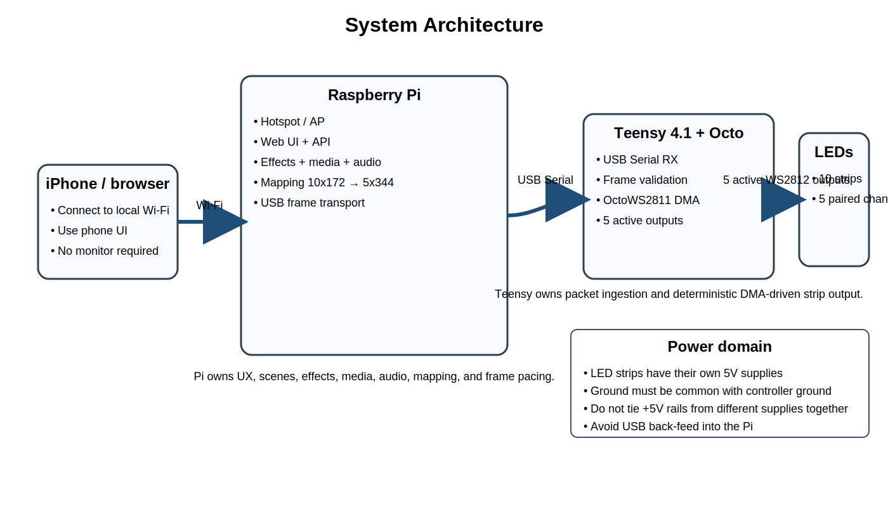

# 02. System Architecture



## 2.1 Architecture decision

### Chosen architecture
**Raspberry Pi as control/render appliance + Teensy 4.1 as deterministic LED output coprocessor**

This is effectively a small distributed system:

- **Phone**
  - user interface only

- **Raspberry Pi**
  - control plane
  - render plane
  - media plane
  - scene/state plane

- **Teensy 4.1**
  - real-time output plane

- **OctoWS2811 adaptor**
  - signal conditioning / buffered output

- **LED power supplies**
  - pixel power only
  - not application compute power

## 2.2 High-level data flow

```text
iPhone
  ↓ Wi-Fi
Raspberry Pi hotspot / web app
  ↓ local API + WebSocket
Render scheduler
  ↓ frame serializer
USB Serial
  ↓
Teensy 4.1
  ↓ DMA-backed OctoWS2811 buffers
5 active WS2812 output channels
  ↓
10 physical strips arranged as 5 serpentine pairs on a cylinder
```

## 2.3 Component responsibilities

| Component | Responsibilities | Must not do |
|---|---|---|
| iPhone UI | scene control, parameter changes, uploads, status, diagnostics | real-time rendering |
| Raspberry Pi | web server, hotspot, media import/transcode, audio analysis, effect generation, frame pacing, USB transport | generate WS2812 timings directly |
| Teensy 4.1 | USB packet handling, frame validation, buffer swap, OctoWS2811 driving, local fallback tests | own application UX or media decoding |
| Octo adaptor | 5V buffering, line conditioning, RJ45/CAT6 breakout[2] | compute |
| LED supplies | feed strips | power back into host USB path |

## 2.4 Why not use stock PJRC VideoDisplay unchanged?

PJRC's `VideoDisplay` example is useful because it proves the exact general idea: a computer, including a Raspberry Pi-class host, can stream video to Teensy boards over USB.[1]

But for this pillar, it is not a drop-in because:

- your logical render surface is **10 × 172**
- the stock example assumes layout conventions like **`LED_HEIGHT` multiple of 8**[1]
- you need a phone-first product UI, scene management, audio-reactive logic, and headless appliance behavior

So the example is a **reference**, not the final architecture.

## 2.5 Boot sequence

### Normal boot
1. Pi powers on.
2. Pi networking stack brings up hotspot / AP profile.
3. Pi application service starts.
4. Pi opens USB connection to Teensy.
5. Pi sends a `HELLO` / `CONFIG` packet.
6. Teensy responds with firmware + capability info.
7. UI becomes reachable from phone.
8. Last-used scene autostarts after a short delay.
9. Operator can override from phone.

### Degraded boot: Teensy missing
1. Pi hotspot and web UI still come up.
2. UI shows hardware-disconnected status.
3. Effects can still preview in software.
4. When Teensy appears, Pi auto-binds and resumes output.

### Degraded boot: Pi app crashes
1. Teensy holds the last valid frame or enters a configurable safe state.
2. systemd restarts the Pi service.
3. UI reconnects automatically.

## 2.6 Networking mode

### Recommended default
- Pi boots into **dedicated AP/hotspot mode**
- fixed SSID/password
- static local gateway IP, e.g. `192.168.4.1`
- local web UI on `http://192.168.4.1`
- mDNS alias such as `pillar.local`

Raspberry Pi supports headless deployment, and NetworkManager's `nmcli` supports creating a Wi-Fi hotspot connection profile.[5][6]

### Why AP-first is the correct decision
- no dependency on venue Wi-Fi
- predictable phone workflow
- no monitor required
- no LAN admin rights required
- field-deployable

### Optional future mode
- client mode on existing Wi-Fi
- still retain an AP fallback profile

## 2.7 Process / service model on Pi

### Preferred deployment model
One main application service with internal worker tasks plus one network profile:

- `pillar.service`
  - FastAPI web server
  - WebSocket live updates
  - render scheduler
  - audio analysis worker
  - media playback worker
  - USB transport worker
  - persistent state manager

- NetworkManager hotspot profile
  - configured once
  - auto-start on boot

This is simpler than splitting everything into several IPC-heavy services.

## 2.8 Control-plane vs output-plane contract

The Pi owns:
- **what to show**
- scene graph / presets
- timing target
- transitions
- audio analysis
- media selection
- diagnostics triggers

The Teensy owns:
- **how to get pixels on the wire**
- bounded-latency packet ingestion
- frame validation
- output DMA
- strip test modes

This separation is the entire point of the architecture.

## 2.9 Failure containment rules

| Failure | Containment rule |
|---|---|
| UI browser disconnects | current scene continues |
| Audio source disappears | effect falls back to non-audio mode |
| Video decode stalls | last good frame holds; transport does not send partial data |
| USB hiccup | Teensy drops malformed frame, keeps last valid frame |
| Hotspot unavailable | Pi app still boots and logs error |
| One LED PSU fails | only that powered segment should go dark; controller survives |

## 2.10 Core design principles for implementation

1. **Keep USB protocol binary and explicit.**
2. **Do not let the Teensy perform heavyweight rendering.**
3. **Do not let the Pi try to generate WS2812 timings directly under Linux.**
4. **Treat wiring/mapping as a first-class subsystem.**
5. **Optimize for stable 60 FPS first; chase higher FPS only after instrumentation.**
6. **Make diagnostics accessible from the phone UI.**

## References

[1] PJRC OctoWS2811 library  
[2] PJRC OctoWS2811 adaptor board  
[5] Raspberry Pi headless setup  
[6] NetworkManager `nmcli` hotspot
