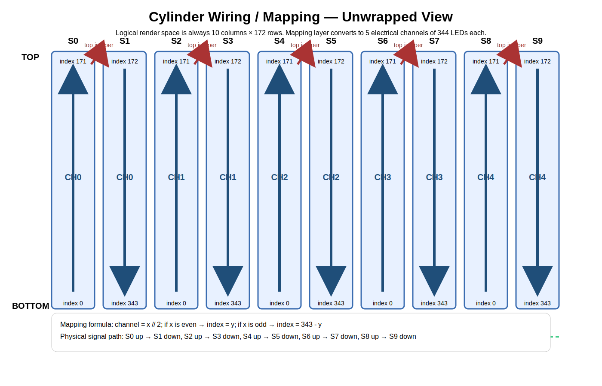

# 04. Wiring and Mapping



## 4.1 Physical assumption

This planning packet assumes the following physical arrangement:

- The pillar is viewed from the **outside**
- The 10 strips are numbered around the circumference as:
  - `S0, S1, S2, ... S9`
- Numbering increases **clockwise when viewed from above**
- Each strip runs vertically
- Each adjacent pair is wired in series so the signal:
  - starts at the **bottom** of the first strip in the pair
  - runs **up** that strip
  - jumps across at the **top**
  - then runs **down** the neighboring strip

If the real mechanical build ends up mirrored or seam-shifted, only the mapping config changes. The software architecture does not.

## 4.2 Electrical pairing plan

| Octo output | Physical strips | Direction on first strip | Direction on second strip | LEDs total |
|---|---|---|---|---:|
| CH0 | S0 + S1 | bottom → top | top → bottom | 344 |
| CH1 | S2 + S3 | bottom → top | top → bottom | 344 |
| CH2 | S4 + S5 | bottom → top | top → bottom | 344 |
| CH3 | S6 + S7 | bottom → top | top → bottom | 344 |
| CH4 | S8 + S9 | bottom → top | top → bottom | 344 |
| CH5 | unused | — | — | 0 |
| CH6 | unused | — | — | 0 |
| CH7 | unused | — | — | 0 |

OctoWS2811 is designed for 8 equal-length strips, but PJRC explicitly allows shorter or unused outputs, addressed as if 8 full strips existed.[1]

## 4.3 Standard Octo pin assignments

If you use the OctoWS2811 adaptor and default pin list, PJRC documents the default output pins for Teensy 4.0/4.1 as:[1]

| Strip / channel | Teensy pin |
|---|---:|
| CH0 | 2 |
| CH1 | 14 |
| CH2 | 7 |
| CH3 | 8 |
| CH4 | 6 |
| CH5 | 20 |
| CH6 | 21 |
| CH7 | 5 |

Teensy 4.x can also use custom pin groups if needed, but default pins are fine for this build.[1]

## 4.4 Logical render model

### Rule
The Pi should always render to a **logical cylindrical canvas**:

- width = **10** columns
- height = **172** rows
- each column corresponds to one physical strip
- row `0` = **bottom**
- row `171` = **top**

This is the only sane way to keep effects/video understandable.

### Why this matters
The wiring is serpentine.
The content should not be.

The mapping layer exists specifically so:
- artists and UI controls think in **10 strip-columns**
- hardware gets the **5 chained channels** it physically needs

## 4.5 Mapping formula

Let:

- `x` = logical strip column, `0..9`
- `y` = logical row, `0..171`
- `N = 172`

Then:

```python
channel = x // 2

if x % 2 == 0:
    # first strip in the pair, wired bottom -> top
    index = y
else:
    # second strip in the pair, wired top -> bottom
    index = (2 * N - 1) - y   # 343 - y
```

Examples:

| Logical pixel `(x, y)` | Physical channel | Channel index |
|---|---:|---:|
| (0, 0) | CH0 | 0 |
| (0, 171) | CH0 | 171 |
| (1, 171) | CH0 | 172 |
| (1, 0) | CH0 | 343 |
| (2, 0) | CH1 | 0 |
| (3, 0) | CH1 | 343 |
| (9, 0) | CH4 | 343 |

## 4.6 Unwrapped cylinder view

```text
Viewed as a flat unwrapped surface, outside of cylinder facing you:

   x=0   x=1   x=2   x=3   x=4   x=5   x=6   x=7   x=8   x=9
   S0    S1    S2    S3    S4    S5    S6    S7    S8    S9

top  ↑     ↓     ↑     ↓     ↑     ↓     ↑     ↓     ↑     ↓
     |     |     |     |     |     |     |     |     |     |
     |     |     |     |     |     |     |     |     |     |
bot  0    343    0    343    0    343    0    343    0    343
```

A more useful mental model is:

```text
CH0: S0 bottom -> top, jump, S1 top -> bottom
CH1: S2 bottom -> top, jump, S3 top -> bottom
CH2: S4 bottom -> top, jump, S5 top -> bottom
CH3: S6 bottom -> top, jump, S7 top -> bottom
CH4: S8 bottom -> top, jump, S9 top -> bottom
```

## 4.7 Seam handling

The pillar has a natural seam between:
- `S9` and `S0`

Effects and video should support wraparound horizontally:
- `x = -1` maps to `x = 9`
- `x = 10` maps to `x = 0`

This matters for:
- rotating effects
- scrolling text
- polar/radial visualizations
- seamless video panoramas

## 4.8 Commissioning tests

The UI must expose these tests:

| Test | Purpose |
|---|---|
| one-strip-at-a-time color wash | verify physical strip numbering |
| bottom-to-top white sweep | verify vertical orientation |
| paired serpentine chase | verify top jumper direction |
| seam marker on S0/S9 | verify wrap boundary |
| channel test CH0..CH4 | verify Octo output assignment |
| RGB order test | verify GRB vs RGB assumption |

## 4.9 Wiring quality requirements

PJRC recommends:
- LED power supply ground and Teensy signal ground should meet at or near the strip signal inputs
- LED power supplies should be close to the strips with large-diameter wires
- the Octo adaptor's 74HCT245 buffer and 100-ohm impedance matching help signal quality[2]

Adafruit recommends:
- common ground first
- 300–500 Ω resistor near the first pixel input
- separate LED power should be applied before the microcontroller if possible
- 5V-powered NeoPixels ideally receive a 5V data signal[7]

Because the Octo adaptor already includes a **74HCT245 buffer chip and 100 Ω matching resistors**, do **not** add another level shifter in front of those same outputs unless you know exactly why.[2]

## 4.10 Power distribution rules

### Required
- Each supply's **ground** must be common with controller ground.
- Different supplies' **+5V rails must not be tied together** across different strip runs.[7]
- Inject power at minimum at:
  - the bottom of each physical strip
  - and preferably both ends of long runs

### Strong recommendation
Treat each **172-pixel physical strip** as a power-injection segment even though two are chained for data.

## 4.11 USB power vs external 5V caution

PJRC notes that VIN and VUSB are tied on Teensy unless the board pads are cut, and external 5V should not be back-fed into the computer over USB.[2][3]

So if the Octo adaptor / LED-side 5V also powers the Teensy, you must make a clean power decision:

### Option A — preferred
- Pi USB powers Teensy logic
- LED supplies power only the strips and Octo buffer side
- grounds common
- no 5V back-feed path to the Pi

### Option B
- external 5V powers Teensy
- **cut VIN-VUSB link** as PJRC instructs[2][3]
- keep USB data connected only

Do not wing this part.

## References

[1] PJRC OctoWS2811 library  
[2] PJRC OctoWS2811 adaptor board  
[3] PJRC Teensy 4.1  
[7] Adafruit NeoPixel best practices
